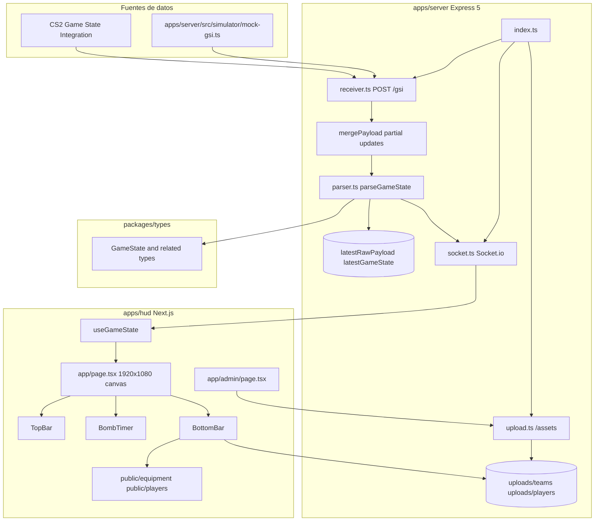
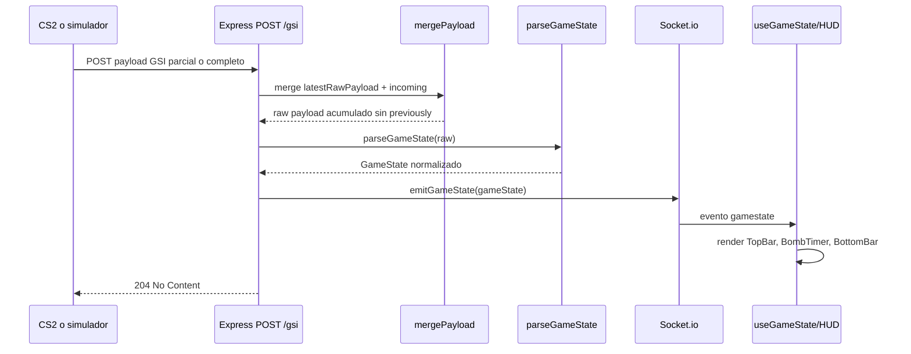
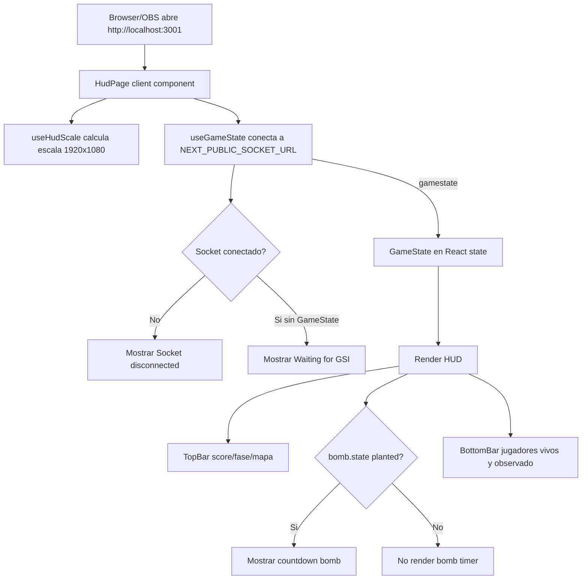
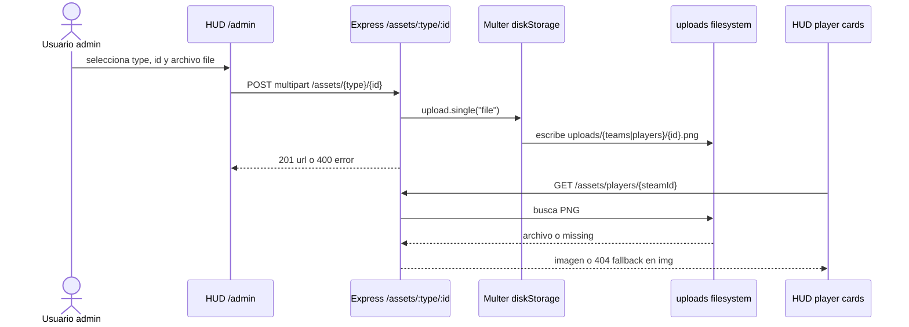
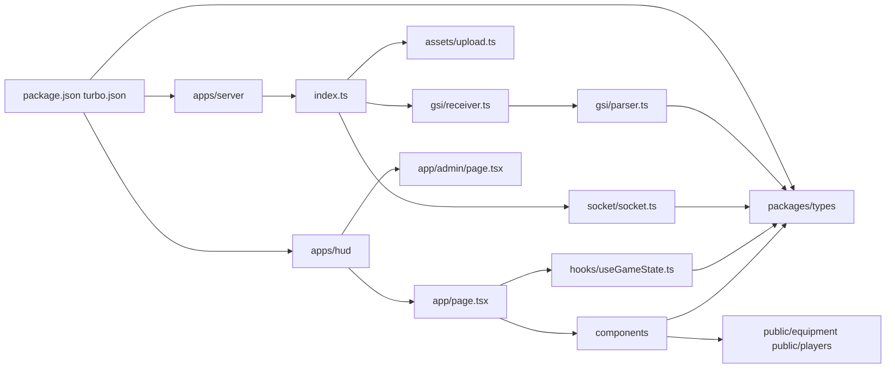
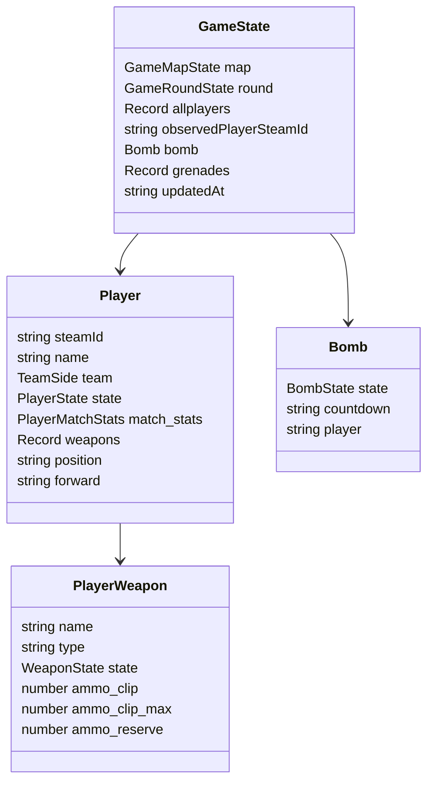
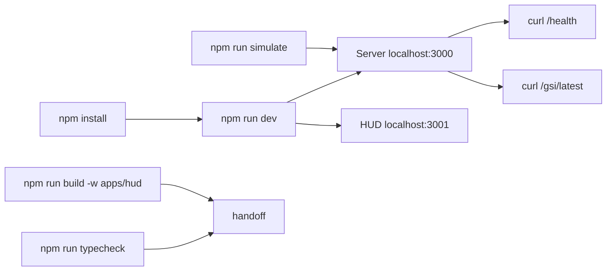

# Flujos De Arquitectura
> Generado: 2026-05-04 | Agente: analisting

## Arquitectura General

## Secuencia GSI En Vivo

## Flujo De Conexion HUD

## Flujo De Uploads

## Mapa De Modulos

## Estado Normalizado

## Flujo De Desarrollo Local

