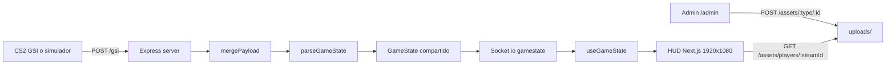

# Analisis Del Proyecto
> Generado: 2026-05-04 | Agente: analisting

## Resumen Ejecutivo
`hud-cs2` es un monorepo npm/Turbo para un HUD externo de CS2: CS2 o el simulador envian payloads Game State Integration a un server Express, el server normaliza el estado y lo emite por Socket.io a un HUD Next.js pensado para OBS. La arquitectura es chica y clara, con buen contrato de tipos compartidos, pero todavia esta orientada a desarrollo/local: no hay tests reales, CI, auth efectiva ni hardening de uploads.

**Health Score: 7.5/10** | Stack: Express 5, Socket.io, Next.js 16, React 19, TypeScript 5, Tailwind v4 | Tamano: 24 archivos TS/TSX, 2168 LOC | Tests: 0 archivos

## 1. Vista General
- **Proposito**: renderizar un overlay broadcast 1920x1080 para CS2 consumiendo datos GSI en tiempo real.
- **Tipo**: monorepo npm workspace con apps separadas para server y HUD, mas paquete compartido de tipos.
- **Entrypoints reales**: `apps/server/src/index.ts`, `apps/hud/src/app/page.tsx`, `apps/hud/src/app/admin/page.tsx`, `apps/server/src/simulator/mock-gsi.ts`.
- **Contrato compartido**: `packages/types/src/gamestate.ts` exporta `GameState`, `Player`, `Bomb`, armas, rondas y equipos.
- **Persistencia**: no hay base de datos; el estado GSI vive en memoria y los assets subidos viven en `uploads/`.

## 2. Arquitectura
El sistema usa una arquitectura simple event-driven: HTTP recibe GSI, parser normaliza, Socket.io publica, React consume. No hay capa de dominio compleja ni repositorios; el flujo principal esta concentrado en pocas piezas.

## 3. Flujo Principal
1. CS2 usa `gamestate_integration_cs2_hud.cfg` o el simulador usa `GSI_URL` para postear a `POST /gsi`.
2. `apps/server/src/gsi/receiver.ts:37-43` recibe el payload, lo mergea, lo normaliza y emite `gamestate`.
3. `apps/server/src/gsi/receiver.ts:14-35` conserva updates parciales con deep merge y saltea `previously`.
4. `apps/server/src/gsi/parser.ts:32-108` transforma el payload crudo al `GameState` compartido.
5. `apps/server/src/socket/socket.ts:16-20` envia el ultimo estado a clientes nuevos y `apps/server/src/socket/socket.ts:25-28` emite updates.
6. `apps/hud/src/hooks/useGameState.ts:13-25` conecta por Socket.io y guarda estado React local.
7. `apps/hud/src/app/page.tsx:31-55` renderiza `TopBar`, `BombTimer` y `BottomBar` dentro de un canvas transparente escalado.

## 4. Fortalezas
- Separacion clara de responsabilidades entre receiver, parser, socket, uploads y componentes HUD.
- `GameState` compartido evita contratos implicitos entre server y frontend.
- El server maneja payloads GSI parciales, clave para CS2, en `apps/server/src/gsi/receiver.ts:14-35`.
- Clientes Socket.io nuevos reciben estado cached en `apps/server/src/socket/socket.ts:16-20`.
- El HUD preserva fondo transparente y escala un canvas fijo 1920x1080 en `apps/hud/src/app/page.tsx:9-40`.
- Defaults locales estan hardcodeados y son coherentes: server 3000, HUD 3001, socket/server URL localhost.

## 5. Issues Verificados

### Criticos Resueltos En La Primera Mejora
| Issue | Ubicacion | Impacto | Fix sugerido |
|---|---|---|---|
| Upload escribia archivo antes de validar `:type` | `apps/server/src/assets/upload.ts` | Ya no escribe si `type` o `id` son invalidos | Mantener `validateAssetParams` antes de Multer |
| `:id` de assets se usaba como filename/path sin sanitizar | `apps/server/src/assets/upload.ts` | Ahora se restringe a `[A-Za-z0-9_-]+` y se valida path final | Mantener esta restriccion para assets runtime |
| `/gsi` no validaba el token declarado en el cfg | `apps/server/src/gsi/receiver.ts`, `apps/server/src/simulator/mock-gsi.ts` | Ahora valida `GSI_AUTH_TOKEN` y el simulador envia el token | Cambiar token por env fuera de localhost |

### Importantes
| Issue | Ubicacion | Impacto | Fix sugerido |
|---|---|---|---|
| No hay tests ni script `test` | `package.json:10-15`, `apps/server/package.json:6-12`, `apps/hud/package.json:6-12` | Parser, merge y uploads no tienen red de seguridad | Agregar Vitest o node:test para parser/merge/upload validation |
| `lint` no es lint real; ejecuta `tsc --noEmit` | `apps/server/package.json:8-10`, `apps/hud/package.json:8-11` | No detecta style bugs, hooks rules, imports muertos ni accesibilidad basica | Agregar ESLint/Prettier o renombrar scripts para no dar falsa cobertura |
| Deep merge puede dejar entidades obsoletas | `apps/server/src/gsi/receiver.ts:21-30` | Granadas, armas o jugadores ausentes pueden persistir si CS2 deja de enviarlos | Reemplazar mapas volatiles cuando aparecen o interpretar `previously` para removals |
| Upload todavia no valida firma real de imagen | `apps/server/src/assets/upload.ts` | Mimetype puede ser falso aunque ahora hay allowlist y limite 2 MB | Validar magic bytes o normalizar imagen |
| Round history no es historico real | `apps/hud/src/components/TopBar/RoundHistory.tsx:6-24` | Los pips derivan de score acumulado y pueden mentir sobre orden de rondas | Trackear winners reales en estado normalizado |
| Jugadores muertos desaparecen del bottom bar | `apps/hud/src/components/BottomBar/index.tsx:31-36`, `apps/hud/src/components/BottomBar/PlayerCard.tsx:99-100` | Se pierde contexto de composicion de equipos | Mostrar muertos atenuados/skull en vez de filtrarlos |

### Menores
| Issue | Ubicacion | Impacto | Fix sugerido |
|---|---|---|---|
| M4A4 usa asset generico | `apps/hud/src/components/BottomBar/WeaponIcon.tsx` | Ya no cae al AK-47, pero comparte icono con M4A1 | Agregar SVG especifico de M4A4 si se necesita precision |
| Upload de teams existe pero HUD no consume logos | `apps/hud/src/app/admin/page.tsx:45`, `apps/hud/src/components/TopBar/index.tsx:19-38` | UI admin promete funcionalidad no visible | Renderizar logos en `TeamScore` o quitar/renombrar upload de teams |
| Google Fonts externo en OBS | `apps/hud/src/app/globals.css:1` | OBS/offline puede no cargar tipografias | Self-host fonts o aceptar fallback del sistema |

## 6. Dependencias Y Tooling
- Root usa npm workspaces y Turbo: `package.json:5-15`, `turbo.json:3-18`.
- Server runtime: Express 5, Socket.io, CORS, Multer, `@cs2-hud/types`.
- HUD runtime: Next 16, React 19, Socket.io client, Tailwind v4.
- `packages/types` exporta TS source directo en `packages/types/package.json:6-12`; Next lo transpila con `transpilePackages` en `apps/hud/next.config.ts:7-11`.
- No se encontro CI workflow ni configuracion ESLint/Prettier/test runner.

## 7. Seguridad
- El token en el cfg GSI ahora se valida contra `GSI_AUTH_TOKEN` con default `cs2-hud-dev`.
- Los uploads ya validan `type`, `id`, allowlist de mimetypes y limite 2 MB; falta validacion real por firma de archivo.
- Si el server queda expuesto fuera de localhost/LAN, `/gsi` permite spoofing de partida y `/assets` permite overwrite de imagenes.

## 8. Cobertura De Tests
- Test files: 0.
- Source files TS/TSX relevantes: 24.
- Cobertura estimada: desconocida/0 por ausencia de runner.
- Areas prioritarias para tests: `mergePayload`, `parseGameState`, validacion de uploads, `BottomBar` selection/filtering, `RoundTimer` cuando se agregue countdown.

## 9. Recomendaciones Priorizadas
1. **Agregar tests de logica GSI/uploads**: parser, merge y validaciones ya son suficientemente importantes para cubrirlos.
2. **Completar validacion de imagenes**: verificar firma/magic bytes o normalizar archivos subidos.
3. **Completar datos broadcast reales**: round winners reales sigue pendiente para que `RoundHistory` no sea derivado.
4. **Mostrar muertos en HUD**: preservar contexto de 5 jugadores por equipo.
5. **Agregar CI/lint real**: automatizar `npm ci`, `npm run typecheck`, `npm run build -w apps/hud` y lint real.

## 10. Quick Wins
- Agregar `m4a4.svg` especifico si se quiere distinguir M4A4 de M4A1.
- Mejorar error handling de `/admin` con `try/catch` y mostrar respuesta del server.
- Agregar `limits.fileSize` a Multer.
- Agregar un test unitario para `parseGameState` con payload minimo y payload malformado.

Ver diagramas completos en `docs/analysis/ARCHITECTURE_FLOW.md` y deuda tecnica en `docs/analysis/TECHNICAL_DEBT.md`.
